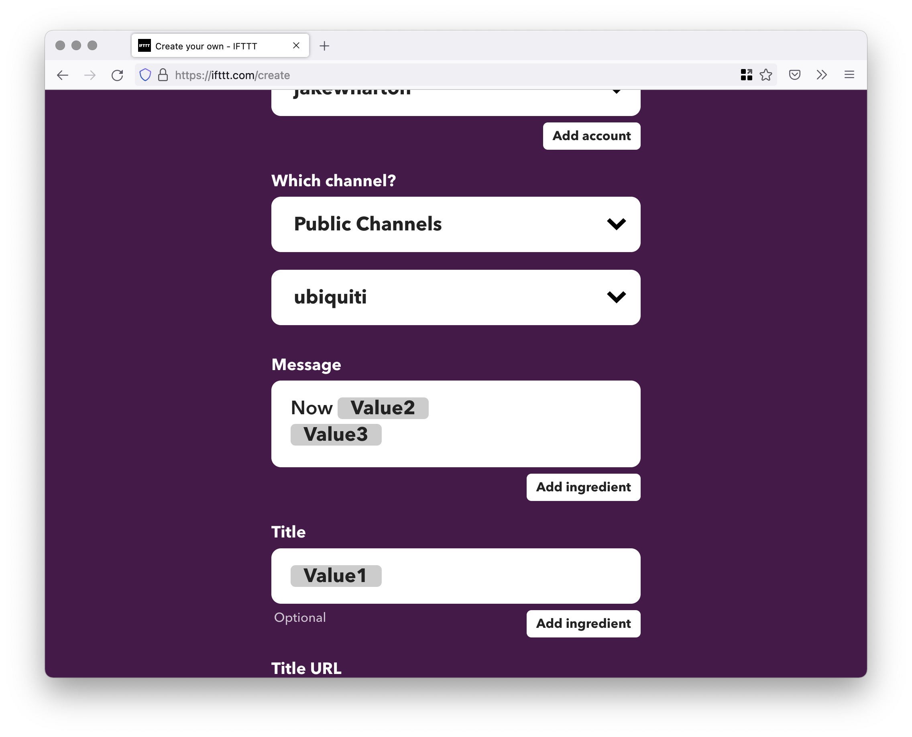

# UI Spy

Monitor products on the [Ubiquiti Store](https://store.ui.com) and receive notifications when their availability changes.

**!!! WARNING !!!** As of July 22nd, 2022 this tool is **currently broken** as Ubiquiti migrated their store to new infrastructure.


Available as a binary and Docker container.

## Usage

You can run UI Spy in one of two ways:

* [Command line](#command-line)
* [Docker](#docker)

### Command-line

Install on Mac OS with:
```
$ brew install JakeWharton/repo/ui-spy
```

For other platforms, download ZIP from
[latest release](https://github.com/JakeWharton/ui-spy/releases/latest)
and run `bin/ui-spy` or `bin/ui-spy.bat`.

```
$ ui-spy --help
Usage: ui-spy [OPTIONS] CONFIG

Options:
  --hc-host URL  Alternate host for health check notification
  --hc ID        ID of https://healthchecks.io/ to notify
  --data PATH    Directory into which available products are tracked (default
                 in-memory)
  -h, --help     Show this message and exit

Arguments:
  CONFIG  Path to config TOML
```


### Docker

A container which runs the binary is available from Docker Hub and GitHub Container Registry.

* `jakewharton/ui-spy`
	[][hub]
	[][hub]

* `ghcr.io/jakewharton/ui-spy`

[hub]: https://hub.docker.com/r/jakewharton/ui-spy/

The container expects to load the [configuration TOML](#configuration) from `/config/config.toml` so mount a volume accordingly.

Product availability data is stored in `/data` which you can either mount to persist it across container restarts or not to keep it only in memory.

To be notified when the tool is failing visit https://healthchecks.io, create a check, and specify the ID to the container using the HEALTHCHECK_ID environment variable.

#### Docker Compose

```yaml
version: '2'
services:
  ui-spy:
    image: jakewharton/ui-spy
    restart: unless-stopped
    volumes:
      - /path/to/config:/config
```


### Configuration

The configuration file allows customization of behavior and specifies the desired products to monitor.

```toml
# The product handles (and their optional variant ID) to monitor for availability (required).
#  Value: Array of strings.
products = [
  "udm-pro",
]

# URL of IFTTT webhook to trigger for product availability changes (optional). If not specified, the
# tool will only log product availability changes to the console.
#  Value: Valid URL as string.
#  Default: none
ifttt = "https://maker.ifttt.com/trigger/ui-spy/with/key/abc123def456"

# Duration between each check (optional).
#  Value: ISO 8601 duration string representing a positive value.
#    See https://en.wikipedia.org/wiki/ISO_8601#Durations.
#  Default: "PT1M" (1 minute)
checkInterval = "PT5M"

# Base URL of the store (optional). Useful for targeting stores in other geographical markets.
#  Value: Valid URL as string.
#  Default: "https://store.ui.com"
store = "https://ca.store.ui.com"

# Whether to also notify when a new product is added (optional).
#  Value: boolean
#  Default: false
productAddNotifications = true
```

#### Products and product variants

The product handle can be found at the end of the Ubiquiti store URL.

For example, the URL for the [Dream Machine Pro](https://store.ui.com/collections/unifi-network-unifi-os-consoles/products/udm-pro) is `https://store.ui.com/collections/unifi-network-unifi-os-consoles/products/udm-pro` so its product handle is `udm-pro`.

Some products have multiple variants. The [G4 Bullet](https://store.ui.co3m/collections/unifi-protect/products/unifi-protect-g4-bullet-camera) comes as a single unit or a three pack. Adding its product handle `unifi-protect-g4-bullet-camera` will notify you of availability changes across both variants. That is, if either variant is available the tool will consider it available and only when both variants become unavailable will it be marked as unavailable.

A single variant can be monitored by appending an `@` and the variant ID to the handle. The variant ID can be found by (re)selecting the variant on the product page. In the case of the G4 Bullet, re-selecting the single unit variant changes the URL from `.../products/unifi-protect-g4-bullet-camera` to `.../products/unifi-protect-g4-bullet-camera?variant=31976667775065`. Thus, the handle for this variant would be `unifi-protect-g4-bullet-camera@31976667775065`.

#### IFTTT setup

Visit [ifttt.com/create](https://ifttt.com/create) to create a new applet. Select "Add" in the trigger section.


Search "webhook" and select the "Webhooks" trigger.


Select the "Receive a web request" variant of the webhook trigger.


Give the webhook trigger a unique event name such as "ui-spy" and select "Create trigger".


The trigger is now complete. Instructions for retrieving the URL are at the end. Select "Add" in the service section to complete the applet.


Choose a service such as posting to a Slack channel.


The webhook payload contains three values:

 * `Value1`: The product name like "Dream Machine Pro" or the product and variant name like "Camera G4 Bullet [3-Pack]"
 * `Value2`: Either "Available" or "Unavailable"
 * `Value3`: The product or product variant URL



Once the service is added the applet is fully configured. Select "Continue" to finish.


Give the applet a friendly name and select "Finish".


The applet is now ready to use.

Visit [ifttt.com/maker_webhooks](https://ifttt.com/maker_webhooks) and select "Documentation" to obtain the webhook key.
The webhook URL can then be created from this template:

```
https://maker.ifttt.com/trigger/{event}/with/key/{key}
```

Where `{event}` should be replaced with the "ui-spy" or whichever event name you selected.
And `{key}` should be replaced with the key obtained from the documentation.


## Development

To run the latest code build with `./gradlew assemble`. This will put the application into
`build/install/ui-spy/`. From there you can use the [command-line instructions](#command-line)
to run. Tests can be run with `./gradlew build`.

The Docker container can be built with `docker build .`.


## License

    Copyright 2022 Jake Wharton

    Licensed under the Apache License, Version 2.0 (the "License");
    you may not use this file except in compliance with the License.
    You may obtain a copy of the License at

       http://www.apache.org/licenses/LICENSE-2.0

    Unless required by applicable law or agreed to in writing, software
    distributed under the License is distributed on an "AS IS" BASIS,
    WITHOUT WARRANTIES OR CONDITIONS OF ANY KIND, either express or implied.
    See the License for the specific language governing permissions and
    limitations under the License.
